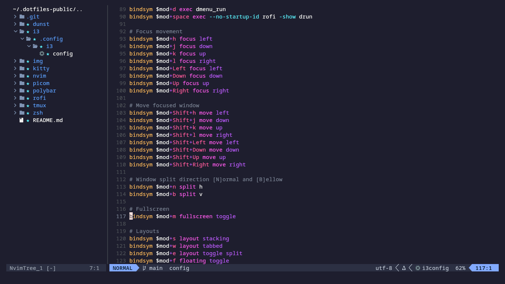
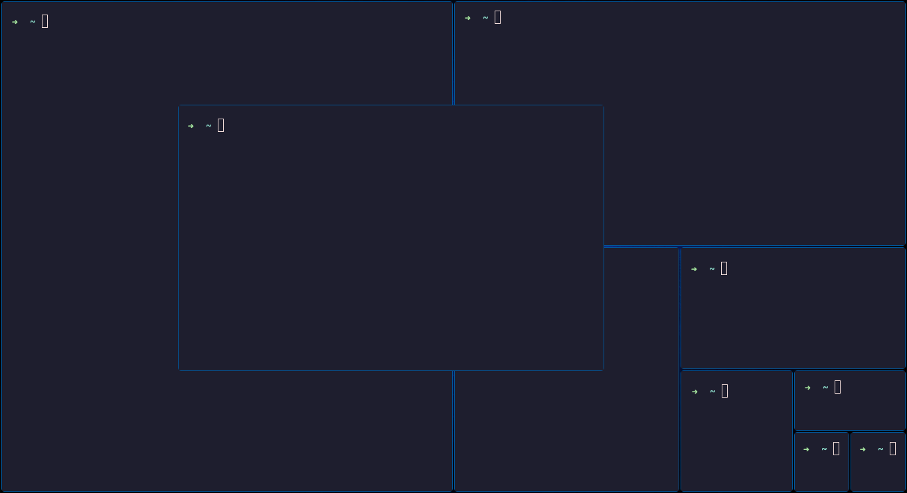
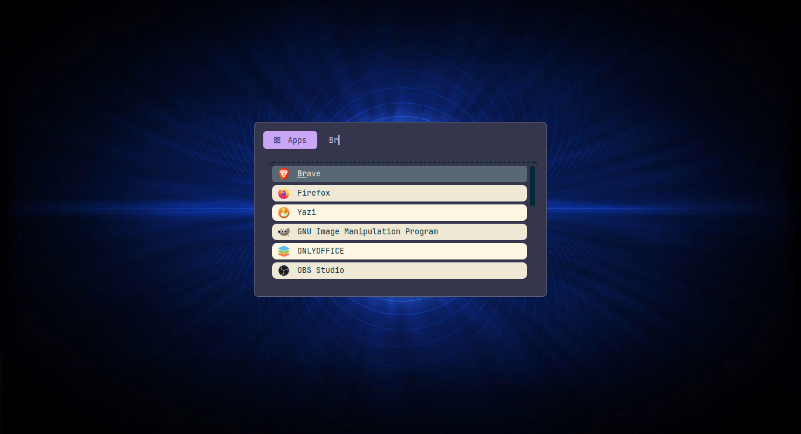
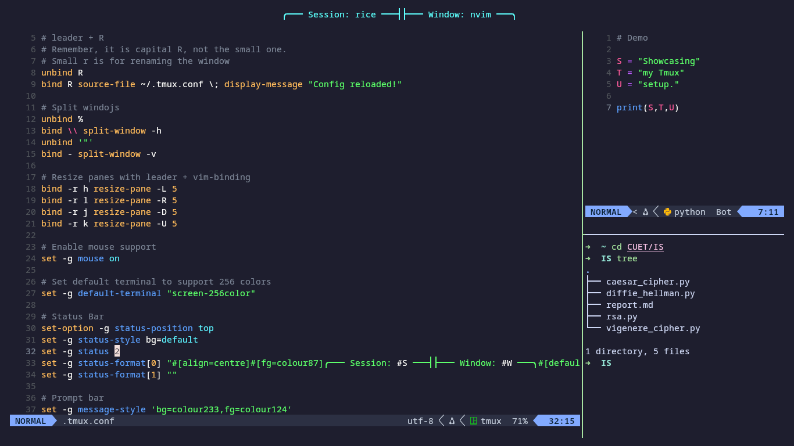
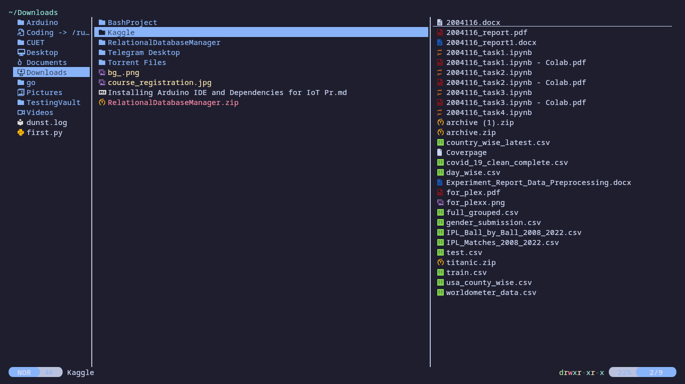
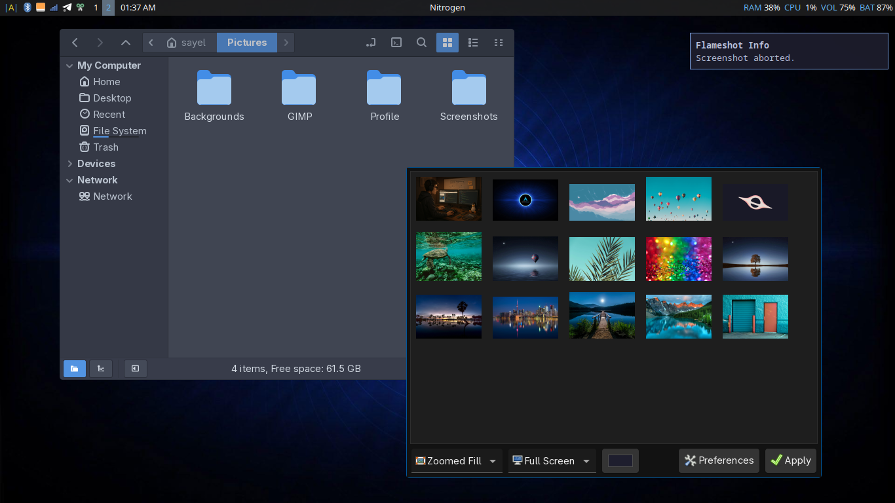

# Sayel's i3 dotfile

This is my lightweight linux setup with efficient window management, optimized for speed and aesthetics.  
Feel free to explore and customize these configurations for your own setup.

## 🌐 My System Setup

- **Distro:** Arch Linux  
- **Window Manager:** i3  
- **Compositor:** Picom  
- **Terminal Emulator:** Kitty  
- **Shell:** Zsh  
- **Text Editor:** Neovim
- **Package Manager:** pacman & yay  
- **Notification Daemon:** Dunst  
- **Status Bar:** Polybar  
- **File Manager:** Nemo(GUI) and Yazi(CLI)  
- **Wallpaper Manager:** Nitrogen  

## 🖼️ Showcase

### Neovim:  
 

### Kitty:  
  

### Rofi:  
  

### Tmux:  
  

### Yazi:  
  

### Polybar, Dunst , Nemo and Nitrogen:  
  

## 🔗 Useful Links

- [Arch Linux](https://archlinux.org)  
- [i3 Window Manager](https://i3wm.org)  
- [picom](https://github.com/pijulius/picom) 
- [Kitty Terminal](https://github.com/kovidgoyal/kitty)  
- [Oh My Zsh](https://github.com/ohmyzsh/ohmyzsh) 
- [Neovim](https://neovim.io)  
- [Dunst Notification Daemon](https://github.com/dunst-project/dunst)  
- [Polybar](https://github.com/polybar/polybar)  
- [Nemo File Manager](https://github.com/linuxmint/nemo)  
- [Yazi CLI File Manager](https://github.com/sxyazi/yazi)  
- [Nitrogen Wallpaper Manager](https://github.com/l3ib/nitrogen)  
